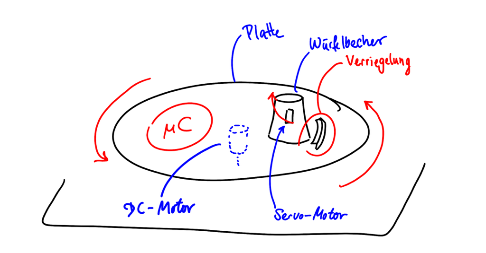
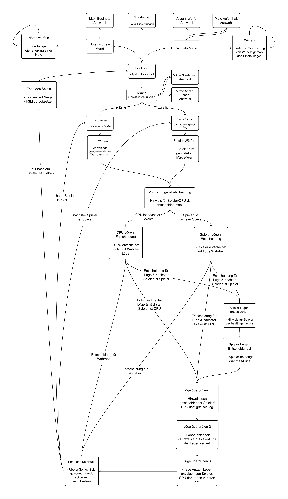
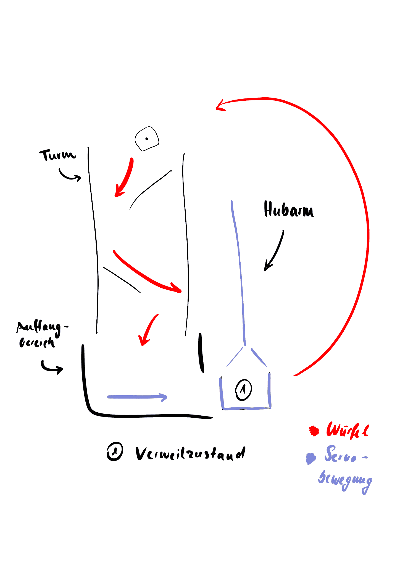

# Automated Dice Shaker

***
Project for "Introduction to Microcomputers 2" by Marco Schweizer & Moritz Loch

&copy; 2023

***

## Konzept

Die Entwicklung des Konzeptes für dieses Projekt erfolgte mithilfe von ChatGPT und dem Prompt "Lustige Arduino Projekte". Die Idee eines automatisierten Würfelbechers wurde zum "Mäxle-Automat" erweitert, ein Automat der das beliebte Würfel-(Trink-)spiel spielen kann.
In der ursprünglichen Planung war angedacht, das automatisierte Würfeln durch eine rotierende Grundplatte zu realisieren. Der Würfel sollte durch den Drehimpuls gewürfelt werden. Zur Erkennung des Würfelergebnisses sollte ein Farbsensor die Farbe eines Farbwürfels registrieren.
Die folgende Skizze zeigt das ursprüngliche Konzept.



Zu Beginn des Projektes zeigte sich, dass der TCS3200 Farbsensor nicht zuverlässige die Farbe des Farbwürfels identifizieren kann. Grund dafür ist unter anderem, dass keine gleichmäßige Belichtung des Würfels sichergestellt werden konnte und die Farben des Würfels zu nah beieinander liegen, dass häufige Verwechslungen auftraten.
Deshalb wurde entschieden, Software und Hardware separat zu entwickeln. Beide Komponenten sind so aufeinander abgestimmt, dass eine zukünftige Zusammenführung problemlos ist. Die notwendige Schnittstelle dazwischen, ein anderer Sensor ist zukünftig zu Betrachten.

***

## Software

Die Software zum Projekt umfasst eine Finite State Machine (FSM) mit 26 Zustände. Diese ermöglicht eine umfangreiche Menüsteuerung, sowie die Konfiguration und Durchführung von drei verschiedene Spielmodi. Die Informationsausgabe erfolgt mit einem 16x2 LCD-Display. Der Spieler kann durch Drehung eines Rotary Encoders Werte auswählen. Zustands-berghänge geschehen bei Knopfdruck des Rotary Encoders. Ein weiterer Knopf setzt den Zustandsautomaten zurück.
Der Zustandsautomat ist durch ein Switch-Case-Statement implementiert. Dabei besitzt jeder Zustand einer eigene Funktion. In dieser ist sowohl die auszuführende Aktivität als auch der Übergang zum nächsten Zustand geregelt.

Ausgangspunkt des Programms bildet das Hauptmenü zur Auswahl der Spielmodi. Dieses und alle weiteren Scroll-Menüs sind als Funktion
`uint8_t lcdScrollMenu(MenuProperties* menuProperties, const char** menuItemNames, bool* firstFrame)`
implementiert. Diese ermöglicht die Darstellung eines beliebigen Scroll-Menüs.

Vom Hauptmenü aus gelangt der Spieler in die Nebenspielmodi "Würfeln" und "Noten würfeln". Beide können durch Einstellung der Würfel- und Augenzahl bzw. der maximalen Bestnote konfiguriert werden. Alle Spieleinstellungen und -daten werden in der folgenden Struktur gespeichert.

```c
struct FsmProperties{
    bool stateTransition = false;
    bool firstFrame = true;
    state_t currentState = ST_MENU;
    state_t nextState = ST_MENU;
    gameMode_t gameMode;

    int8_t numberOfLives;
    int8_t numberOfPlayers;
    uint8_t lifeCount[9];
    uint8_t currentPlayer;
    uint8_t nextPlayer;
    int8_t prevDiceRollIndex;
    int8_t diceRollIndex;
    bool trueNumberAnnounced;
    int8_t winningPlayer = -1;

    int8_t numberOfDice;
    int8_t numberOfEyes;

    float maxGrade = DEFAULTMAXGRADE;

    bool autoDiceRoll = DEFAULTAUTODICEROLL;
  };
  static FsmProperties fsm;
  ````

Anschließend liefert das Programm mit jedem Knopfdruck ein neues Würfelergebnis bzw. eine neue Note.

Bei Auswahl des Hauptspielmodus "Mäxle" ist zunächst die Auswahl der Anzahl von Leben und die Anzahl der Spieler, die neben der CPU am Spiel teilnehmen. Bei Spielbeginn wird zufällig ein Spieler ausgesucht, der beginnt.
Menschliche Spieler geben ihre Würfelsumme mittels Drehencoder ein. Die CPU würfelt zufällig. Hier kann zukünftig das automatisierte Würfeln mittels Würfelturm eingebunden werden.
Der nächste Spieler entscheidet anschließend mit einem Auswahlmenü ober dem vorhergehenden Spieler glaubt oder nicht. Muss die CPU entscheiden, so tut sie das zufällig. Falls dem würfelndem Spieler nicht geglaubt wird muss dieser nun aufdecken, ob er tatsächlich gelogen hat. Andernfalls beginnt ein neuer Spielzug. Ist der würfelnde Spieler die CPU, dann wird dieser Schritt übersprungen. Zum Schluss wird dem lügenden oder dem falsch ratenden Spieler ein Leben abgezogen.
Ein abschließender Zustand überprüft ob das Spiel im vergangen Spielzug bereits gewonnen wurde und setzt die Spielzugdaten zurück. Im Falle des gewonnen Spiels wird der Sieger auf dem Display ausgegeben und das Spiel kehrt ins Hauptmenü zurück. Andernfalls beginnt der Spielzug des nächsten Spielers.

Der vollständige Zustandsautomat ist [hier](/doc/Maexle_State_Diagram.pdf) zu sehen.



***

## Hardware

Das Projekt greift auf eine Vielzahl an Schnittstellen und Modulen zurück. Die Hauptkomponenten für die Funktion der Software sind Display und Rotary Encoder, beides wurde in ein Bedientableau eingebettet zur komfortableren Handhabung.

Neben den Bedien- und Anzeigeelementen (LCD-Display, Rotary Encoder und Taster), lag der Fokus vor allem auf dem voll- und halbautomatischem Würfelsystem. Bestehend aus 2 Servos und einer Menge an selbst entworfenen Bauteilen wurde das System von Grund auf entwickelt und kann mit einer Ausreichenden Zuverlässigkeit auf Anforderung oder, falls in den Spieleinstellungen festgelegt, selbstständig würfeln.

Das System besteht aus drei Bereichen: Dem Würfelturm, dem Auffangbereich und dem Hubarm.
Der Würfelturm besteht aus zwei schräg angeordneten Platten, welche den Würfel ablenken, wodurch dieser eine zufällige Flugbahn annimmt. Gespeißt wird er durch den Hubarm. Dieser wiederrum erhält den Würfel durch einen Servo-Motor aus dem Auffangbereich, welcher so geformt ist, dass der Würfel bei der Landung oder spätestens bei der Beförderung durch den Servo mittig platziert wird, sodass dieser stets in den Behälter am Hubarm gelangt. Durch Bauteiltoleranzen kann der Würfel quer stehen oder nicht beim ersten Mal in den Behälter passen, weshalb durch Test herausgefunden wurde, dass durch Wiederholen der Servobewegung die Zuverlässigkeit wesentlich erhöht werden konnte, weshalb dies im finalen Code implementiert wurde. Befindet sich der Würfel im Behältnis des Hubarmes, ist dies der Verweilzustand (auch Ausgangszustand), in welcher der Spieler das Ergebnis vom Würfel ablesen kann. Der Hubarm ist so designed, dass sich der Würfel mitsamt Behältnis bis zu einem Winkel von circa 150° lotrecht mitbewegt und erst kurz davor beginnt zu kippen, sodass der Würfel in den Turm geworfen wird.



***
