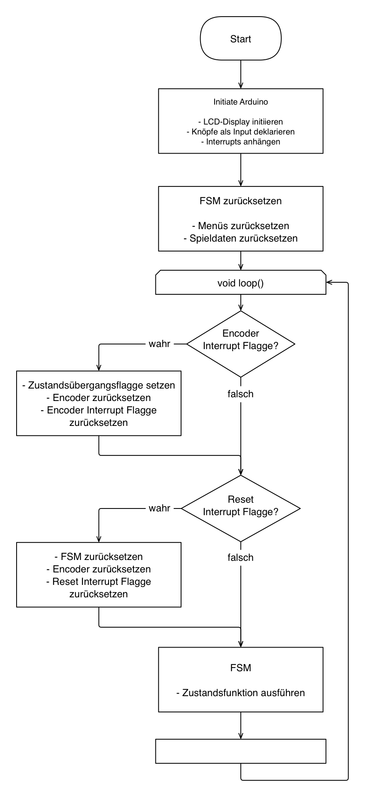

# Automated Dice Shaker

***
Project for "Introduction to Microcomputers 2" by Marco Schweizer & Moritz Loch

&copy; 2023

***

## Konzept

Die Entwicklung des Konzeptes für dieses Projekt erfolgte mithilfe von ChatGPT und dem Prompt "Lustige Arduino Projekte". Die Idee eines automatisierten Würfelbechers wurde zum "Mäxle-Automat" erweitert, ein Automat der das beliebte Würfel-(Trink-)spiel spielen kann.
In der ursprünglichen Planung war angedacht, das automatisierte Würfeln durch eine rotierende Grundplatte zu realisieren. Der Würfel sollte durch den Drehimpuls gewürfelt werden. Zur Erkennung des Würfelergebnisses sollte ein Farbsensor die Farbe eines Farbwürfels registrieren.
Die folgende Skizze zeigt das ursprüngliche Konzept.


Zu Beginn des Projektes zeigte sich, dass der TCS3200 Farbsensor nicht zuverlässig die Farbe des Farbwürfels identifizieren kann. Grund dafür ist unter anderem, dass keine gleichmäßige Belichtung des Würfels sichergestellt werden konnte und die Farben des Würfels im RGB-Farbspektrum zu nahe beieinander liegen, dass häufige Verwechslungen auftraten.
Deshalb wurde entschieden, Mäxle-Spiel und das Würfeln separat zu entwickeln. Beide Komponenten sind so aufeinander abgestimmt, dass eine zukünftige Zusammenführung problemlos ist. Für die notwendige Schnittstelle dazwischen, ist in Zukunft ein anderer Sensor zu Betrachten.

***

## Mäxle-Spiel

### Aufbau

Die Software zum Mäxle-Spiel umfasst eine Finite State Machine (FSM) mit 26 Zustände. Diese ermöglicht eine umfangreiche Menüsteuerung, sowie die Konfiguration und Durchführung von drei verschiedene Spielmodi. Die Informationsausgabe erfolgt mit einem 16x2 LCD-Display. Der Spieler kann durch Drehung eines Rotary Encoders Werte auswählen. Zustandsübergänge geschehen bei Knopfdruck des Rotary Encoders. Ein weiterer Knopf setzt den Zustandsautomaten zurück.
Beide Knöpfe sind Interruptgesteuert.
Die Hauptbedienelemente wurden zur komfortableren Handhabung in ein Bedientableau eingebettet.

### Programmablauf

Im Setup werden das LCD-Display initiiert, I/O deklariert und Interrupts angehängt. Außerdem werden die Menüs und Spieldaten zurückgesetzt.
Die Schleife fragt periodisch ab, ob eine der Interrupt-Flaggen gesetzt wurde. Der Encoder-Interrupt löst einen Übergang zum nächsten Zustand aus. Der Reset-Interrupt setzt das Spiel zurück. Andernfalls wird die, zum aktuellen Zustand zugehörige, Funktion ausgeführt.

Folgende Abbildung zeigt den vereinfachten [Programmablauf](/doc//Maexle_program_sequence.pdf).



### Zustandsautomat

Der Zustandsautomat ist durch ein Switch-Case-Statement implementiert. Dabei besitzt jeder Zustand eine eigene Funktion. In dieser ist sowohl die auszuführende Aktivität als auch der Übergang zum nächsten Zustand geregelt.

Ausgangspunkt des Programms bildet das Hauptmenü zur Auswahl der Spielmodi. Dieses und alle weiteren Scroll-Menüs sind als Funktion implementiert. Diese ermöglicht die Darstellung eines beliebigen Scroll-Menüs. Auch alle weiteren Displayausgaben sind als allgemeine Funktionen umgesetzt.

```c
/**
 * @brief Custom scroll selection menu on lcd display
 * 
 * @param menuProperties Menu from which the items will be selected
 * @param menuItemNames Names of the items in the menu
 * @param firstFrame First frame of FSM state flag
 * @return uint8_t 0
 */
uint8_t lcdScrollMenu(MenuProperties* menuProperties, const char** menuItemNames, bool* firstFrame)
```

Vom Hauptmenü aus gelangt der Spieler in die Nebenspielmodi "Würfeln" und "Noten würfeln". Beide können durch Einstellung der Würfel- und Augenzahl bzw. der maximalen Bestnote beliebig konfiguriert werden. Alle Spieleinstellungen und -daten werden in der folgenden Struktur gespeichert.

```c
/**
 * @brief Stores all current data of FSM
 * 
 */
struct FsmProperties{
    bool stateTransition = false;
    bool firstFrame = true;
    state_t currentState = ST_MENU;
    state_t nextState = ST_MENU;
    gameMode_t gameMode;

    int8_t numberOfLives;
    int8_t numberOfPlayers;
    uint8_t lifeCount[9];
    uint8_t currentPlayer;
    uint8_t nextPlayer;
    int8_t prevDiceRollIndex;
    int8_t diceRollIndex;
    bool trueNumberAnnounced;
    int8_t winningPlayer = -1;

    int8_t numberOfDice;
    int8_t numberOfEyes;

    float maxGrade = DEFAULTMAXGRADE;

    bool autoDiceRoll = DEFAULTAUTODICEROLL;
  };
  static FsmProperties fsm;
  ````

Anschließend liefert das Programm mit jedem Knopfdruck ein neues Würfelergebnis bzw. eine neue Note.

Bei Auswahl des Hauptspielmodus "Mäxle" kann der Spieler zunächst die Anzahl von Leben und die Anzahl der Spieler, die neben der CPU am Spiel teilnehmen wählen. Bei Spielbeginn wird zufällig ein Spieler ausgesucht, der beginnt.
Menschliche Spieler geben ihre Würfelsumme mittels Drehencoder ein. Die CPU würfelt pseudozufällig. Stattdessen kann zukünftig das automatisierte Würfeln mittels Würfelturm eingebunden werden.
Der nächste Spieler entscheidet anschließend mit einem Auswahlmenü ob er dem vorhergehenden Spieler glaubt oder nicht. Muss die CPU entscheiden, so tut sie das zufällig. Falls dem würfelnden Spieler nicht geglaubt wird muss dieser nun aufdecken, ob er tatsächlich gelogen hat. Andernfalls beginnt ein neuer Spielzug. Ist der würfelnde Spieler die CPU, dann wird dieser Schritt übersprungen. Zum Schluss wird dem lügenden oder dem falsch ratenden Spieler ein Leben abgezogen.
Ein abschließender Zustand überprüft ob das Spiel im vergangen Spielzug bereits gewonnen wurde und setzt die Spielzugdaten zurück. Falls das Spiel gewonnen wurde, wird der Sieger auf dem Display ausgegeben und das Spiel kehrt ins Hauptmenü zurück. Andernfalls beginnt der Spielzug des nächsten Spielers.

Der vollständige Zustandsautomat ist [hier](/doc/Maexle_State_Diagram.pdf) zu sehen.


***

## Würfelturm

Neben den Bedien- und Anzeigeelementen (LCD-Display, Rotary Encoder und Taster), lag der Fokus vor allem auf dem halbautomatischem Würfelsystem.
Das ursprüngliche Konzept mit Farberkennung und rotierender Würfelfläche wurde nicht allein aufgrund des Sensors zugunsten der aktuellen Version verworfen, sondern auch bedingt einiger Probleme in der Hardware. Zum einen ist eine rotierende Platte der vorgesehenen Größe schwer zu realisieren, da der Aufbau komplex sein müsste um nicht (in anfänglichen Tests) aus der Balance zu geraten. Zum anderen sind Zweifel an der Umsetzbarkeit aufgekommen, da der Servo den Becher fest auf der Oberfläche halten soll, während die Platte mit einer hohen Drehzahl rotieren muss um den Würfel anzuheben.

Aufgrund dieser Punkte kam es zum Wechsel der Konzepte: Bestehend aus 2 Servos und einer Menge an [selbst entworfenen Bauteilen](/dice_tower/DiceShaker_Files) wurde ein System von Grund auf entwickelt, das mit einer Ausreichenden Zuverlässigkeit auf Anforderung selbstständig würfeln kann. Zukünftig kann die Ansteuerung des Mechanismus direkt durch das Programm des Mäxle-Spiels erfolgen.

Der Würfelturm besteht aus drei Bereichen: Dem Turm, dem Auffangbereich und dem Hubarm.
Der Turm besteht aus zwei schräg angeordneten Platten, welche den Würfel ablenken, wodurch dieser eine zufällige Flugbahn annimmt. Gespeißt wird er durch den Hubarm. Dieser wiederrum erhält den Würfel durch einen Servo-Motor aus dem Auffangbereich, welcher so geformt ist, dass der Würfel bei der Landung oder spätestens bei der Beförderung durch den Servo mittig platziert wird, sodass dieser stets in den Behälter am Hubarm gelangt. Durch Bauteiltoleranzen kann der Würfel quer stehen oder nicht beim ersten Mal in den Behälter passen, weshalb durch Test herausgefunden wurde, dass durch Wiederholen der Servobewegung die Zuverlässigkeit wesentlich erhöht werden konnte. Deshalb wurde dies im finalen Code implementiert.

Die Ansteuerung der Servos geschieht mit dem Arduino über die `#include <Servo.h>` Bibliothek. Bei Knopfdruck wird über die Interruptroutine eine Flag gesetzt, welche die Routine abfragt und gegebenfalls einen Würfelvorgang startet. Es wurden 2 Befehle implementiert `void stepServo(int number, int pos)` und `void jumpServo(int number, int pos)`, welche den entsprechenden Servo zu der gewünschten Position bewegen. Die Position des Servos wird schrittweise verändert durch folgende Funktion:

```c
while ( bottomServo.read() != pos ) {
        j = bottomServo.read();
        bottomServo.write(j + ((pos - j) / abs(pos - j)));  //current position +- 1
        delay(3);
      }
````

Befindet sich der Würfel im Behältnis des Hubarmes, ist dies der Verweilzustand (auch Ausgangszustand), in welcher der Spieler das Ergebnis vom Würfel ablesen kann. Der Hubarm ist so gestaltet, dass sich der Würfel mitsamt Behältnis bis zu einem Winkel von circa 150° lotrecht mitbewegt und erst kurz vor Erreichen des höchsten Punktes beginnt zu kippen, sodass der Würfel in den Turm geworfen wird.


***
